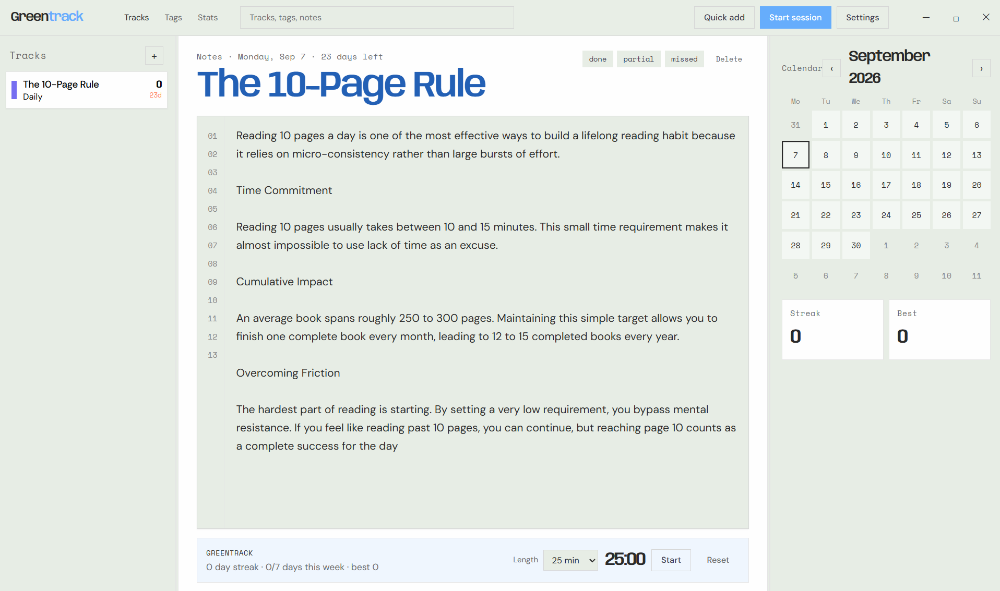

# Greentrack


Windows desktop tracker built with [Tauri](https://tauri.app/). A track can be a habit, a goal, a task, or exam prep. Each one has dated notes, a color-coded calendar, and streaks / a heatmap.

Free and open source. Local only: nothing is uploaded.

## Preview



## Features

- Tracks in the left sidebar, notes in the center, calendar on the right
- Quick add (`Ctrl` / `Cmd` + `K`), tags, and a stats pane
- Session timer: 25 min, 45 min, 1 hour, 2 hours, or 3 hours
- Settings: light / dark, backdrops, and accents
- Closing the window hides the app to the system tray (quit from the tray menu)
- Delete a track from the notes header (confirm first)

Calendar days can be marked done, partial, or missed. Settings also cover heatmap visibility, week start, note size, and reduced motion.

## Requirements

- [Node.js](https://nodejs.org/)
- [Rust](https://rustup.rs/)
- [WebView2](https://developer.microsoft.com/microsoft-edge/webview2/) on Windows (usually already installed)

## Run from source

```bash
npm install
npm run tauri dev
```

## Build a Windows installer

```bash
npm run tauri build
```

That writes:

- portable app: `src-tauri/target/release/greentrack.exe`
- NSIS installer: `src-tauri/target/release/bundle/nsis/Greentrack_0.1.0_x64-setup.exe`
- MSI: `src-tauri/target/release/bundle/msi/Greentrack_0.1.0_x64_en-US.msi`

## Data

Tracks and notes are stored on this computer: browser storage plus `habits.json` in the app data folder. Settings stay in local storage. There is no cloud account.

## License

Greentrack is free and open source under the [MIT License](LICENSE).


Built by [Hummet Azim](https://www.hummet.dev).

